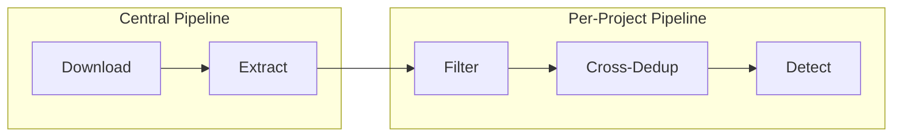

# Data Miner

[](https://www.python.org/downloads/)
[](https://www.postgresql.org/)
[](https://opensource.org/licenses/MIT)
[](https://mvpavan.github.io/data-miner/)

A **PostgreSQL-backed, supervisor-managed video processing pipeline** for generating large-scale computer vision datasets from YouTube videos.

## ✨ Features

- 🔍 **YouTube Search** - Find videos by keywords and hashtags
- 📥 **Smart Downloads** - Rate-limited downloading with hashtag blocklists
- 🎬 **Frame Extraction** - Configurable sampling strategies (interval, time, keyframe)
- 🎯 **ML Filtering** - SigLIP2-based image-text similarity filtering
- 🔄 **Deduplication** - DINOv3/FAISS-based cross-video deduplication
- 🎯 **Object Detection** - Open-set detection (GroundingDINO, OWLv2)

## 🏗️ Architecture



The pipeline uses:
- **PostgreSQL** for state management with row-level locking
- **Supervisor** for worker process management
- **Heartbeat-based locking** for concurrent safety

## 🚀 Quick Start

```bash
# Creates new .venv and Install in editable mode
uv sync

# Install with editable mode in exisiting virtual environment
uv pip install -e .

# Initialize database
data-miner init-db

# Add videos and run pipeline
data-miner populate --config config.yaml
data-miner workers setup --config config.yaml
data-miner workers start
```

## 📁 Project Structure

```
data_miner/
├── cli.py              # CLI commands
├── config/             # Configuration system
├── db/                 # Database layer
├── workers/            # Supervisor-managed workers
├── modules/            # Core processing logic
├── models/             # ML model wrappers
└── utils/              # Utilities
```

## 📚 Documentation

Full documentation is available at **[mvpavan.github.io/data-miner](https://mvpavan.github.io/data-miner/)**

| User Guide | Developer Docs |
|------------|----------------|
| [Installation](https://mvpavan.github.io/data-miner/user-guide/installation/) | [Architecture Overview](https://mvpavan.github.io/data-miner/architecture/overview/) |
| [Configuration](https://mvpavan.github.io/data-miner/user-guide/configuration/) | [Database Models](https://mvpavan.github.io/data-miner/architecture/database-models/) |
| [CLI Reference](https://mvpavan.github.io/data-miner/user-guide/cli-reference/) | [Worker System](https://mvpavan.github.io/data-miner/architecture/workers/) |
| [Quickstart](https://mvpavan.github.io/data-miner/user-guide/quickstart/) | [Contributing](https://mvpavan.github.io/data-miner/development/contributing/) |

## 📄 License

This project is licensed under the MIT License - see the [LICENSE](LICENSE) file for details.
