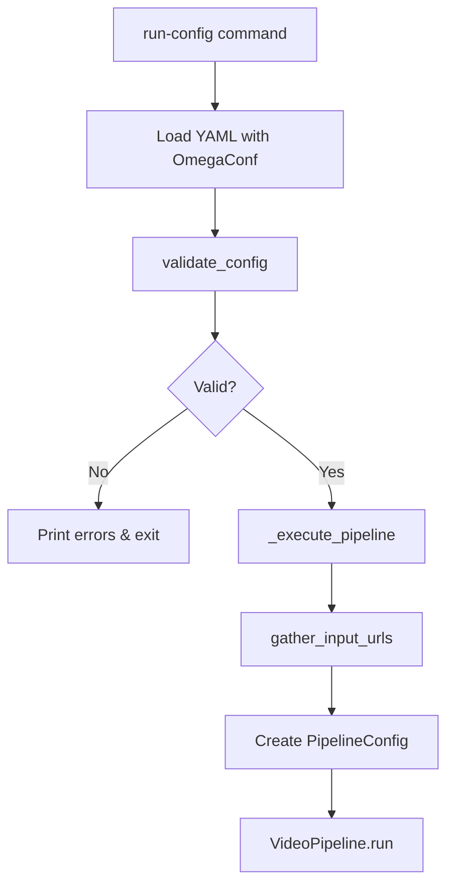
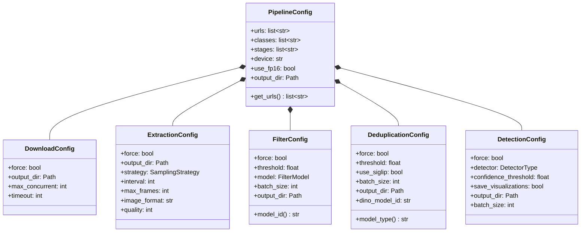
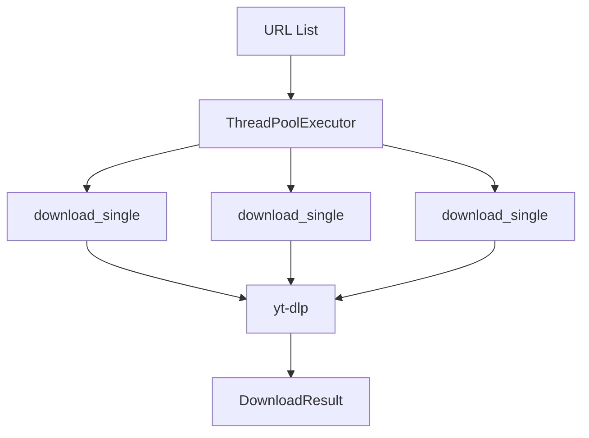
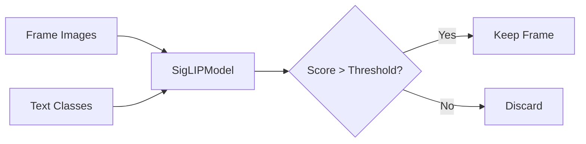
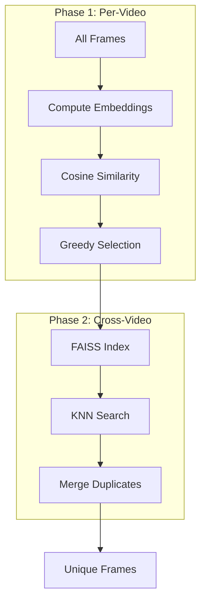
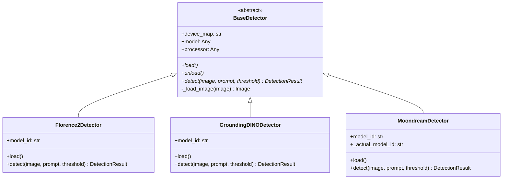
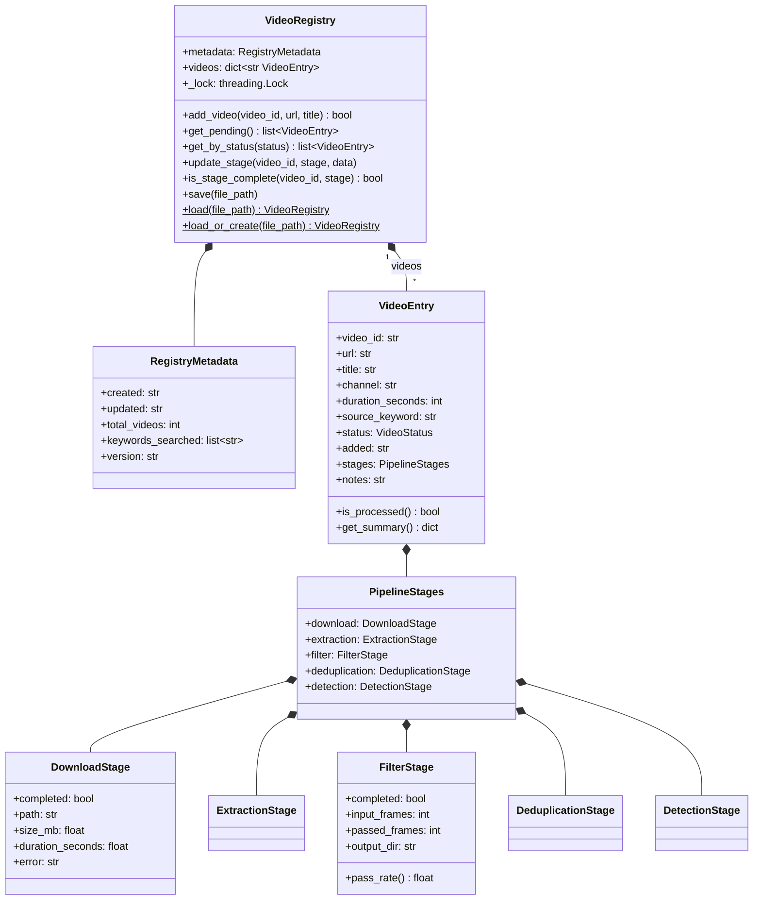
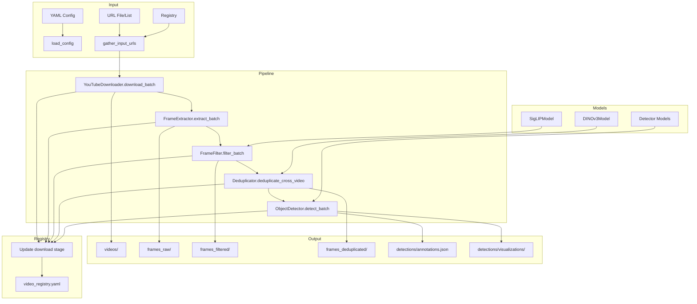

# Video Miner V3 - Detailed Code Walkthrough

A comprehensive guide to the architecture and code flow of Video Miner V3, a high-performance video mining pipeline for generating large-scale computer vision datasets from YouTube videos.


---

## Table of Contents

1. [Project Overview](#project-overview)
2. [Directory Structure](#directory-structure)
3. [Architecture Diagram](#architecture-diagram)
4. [Entry Points](#entry-points)
5. [Configuration System](#configuration-system)
6. [Pipeline Orchestration](#pipeline-orchestration)
7. [Processing Modules](#processing-modules)
8. [ML Model Wrappers](#ml-model-wrappers)
9. [Video Registry System](#video-registry-system)
10. [Utility Functions](#utility-functions)
11. [Data Flow](#data-flow)

---

## Project Overview

Video Miner V3 is designed to:
- **Search** YouTube for videos by keyword
- **Download** highest quality videos
- **Extract** frames with configurable sampling
- **Filter** frames using SigLIP2 semantic similarity
- **Deduplicate** frames using DINOv2/v3 or SigLIP2 embeddings
- **Detect** objects using open-set detection models

---

## Directory Structure

```
video_miner_v3/
├── cli.py                 # Click CLI interface (509 lines)
├── config.py              # Pydantic configuration models (203 lines)
├── config_loader.py       # OmegaConf YAML loading (232 lines)
├── constants.py           # Centralized model IDs & defaults (91 lines)
├── pipeline.py            # Main pipeline orchestrator (688 lines)
├── registry.py            # Video tracking registry (420 lines)
├── search.py              # YouTube search via yt-dlp (281 lines)
├── models/
│   ├── base.py            # BaseModel class, shared utilities
│   ├── siglip_model.py    # SigLIP2 wrapper for filtering
│   ├── dinov3_model.py    # DINOv2/v3 wrapper for dedup
│   └── detector_models.py # Florence2, GroundingDINO, Moondream
├── modules/
│   ├── downloader.py      # YouTube video download
│   ├── frame_extractor.py # Frame extraction with PyAV
│   ├── frame_filter.py    # SigLIP-based filtering
│   ├── deduplicator.py    # Embedding-based dedup with FAISS
│   └── detector.py        # Object detection orchestrator
└── utils/
    ├── device.py          # CUDA/CPU device management
    ├── io.py              # File I/O, video ID extraction
    ├── validators.py      # Input validation
    └── query_generator.py # Query generation utilities
```

---

## Entry Points

### CLI ([cli.py](../video_miner_v3/cli.py))

The main entry point is the `video-miner` CLI built with Click:

```python
@click.group()
@click.option('--verbose', '-v', is_flag=True)
@click.pass_context
def main(ctx: click.Context, verbose: bool):
    """Video Miner v3 - High-performance video mining pipeline."""
    setup_logging(verbose)
```

#### Key Commands

| Command | Function | Description |
|---------|----------|-------------|
| `run-config` | [run_config()](../video_miner_v3/cli.py#L390-L469) | Run pipeline from YAML config file(s) |
| `validate-config` | [validate_config_cmd()](../video_miner_v3/cli.py#L472-L504) | Validate YAML config without running |
| `registry status` | [registry_status()](../video_miner_v3/cli.py#L113-L142) | Show registry statistics |
| `registry list` | [registry_list()](../video_miner_v3/cli.py#L178-L221) | List videos in registry |
| `registry export` | [registry_export()](../video_miner_v3/cli.py#L145-L175) | Export URLs to file |

#### Pipeline Execution Flow



The [_execute_pipeline()](../video_miner_v3/cli.py#L228-L387) function:
1. Loads/creates the video registry
2. Executes optional search stage
3. Gathers URLs from config, files, or registry
4. Builds `PipelineConfig` with all stage configurations
5. Instantiates `VideoPipeline` and calls `run()`

---

## Configuration System

### Pydantic Models ([config.py](../video_miner_v3/config.py))

All configuration uses Pydantic for validation:



#### Enums

| Enum | Values | Location |
|------|--------|----------|
| `DetectorType` | dino-x, moondream3, florence2, grounding-dino | [config.py:35-40](../video_miner_v3/config.py#L35-L40) |
| `SamplingStrategy` | interval, time, keyframe | [config.py:43-47](../video_miner_v3/config.py#L43-L47) |
| `FilterModel` | siglip2-so400m, siglip2-giant | [config.py:50-53](../video_miner_v3/config.py#L50-L53) |

### OmegaConf Loader ([config_loader.py](../video_miner_v3/config_loader.py))

Supports layered configuration merging:

```python
def load_config(user_config, overrides, resolve=True):
    """
    Merge order (later overrides earlier):
    1. config/default.yaml (base defaults)
    2. user_config (user overrides)
    3. overrides dict (CLI/programmatic overrides)
    """
```

Key functions:
- [load_config()](../video_miner_v3/config_loader.py#L21-L86) - Load and merge YAML configs
- [validate_config()](../video_miner_v3/config_loader.py#L115-L212) - Validate required fields
- [print_config()](../video_miner_v3/config_loader.py#L215-L226) - Pretty print configuration

### Constants ([constants.py](../video_miner_v3/constants.py))

Centralized source of truth for all model IDs and defaults:

| Category | Models | Default |
|----------|--------|---------|
| **SigLIP2** | siglip2-so400m, siglip2-giant | siglip2-so400m |
| **DINO** | dinov3-small/base/large/huge/giant, dinov2-base/large | dinov2-base |
| **Detectors** | dino-x, moondream3, florence2, grounding-dino | moondream3 |

Default thresholds:
- Filter: **0.25**
- Dedup: **0.90**
- Detection: **0.3**

---

## Pipeline Orchestration

### VideoPipeline ([pipeline.py](../video_miner_v3/pipeline.py))

The main orchestrator coordinates all processing stages:


#### Constructor

```python
class VideoPipeline:
    def __init__(self, config: PipelineConfig, registry: Optional["VideoRegistry"] = None):
        self.config = config
        self.registry = registry
        # Lazy-loaded modules
        self._downloader = None
        self._extractor = None
        self._frame_filter = None
        self._deduplicator = None
        self._detector = None
```

#### Main Run Method

[VideoPipeline.run()](../video_miner_v3/pipeline.py#L186-L307):

```python
def run(self, show_progress: bool = True) -> PipelineResult:
    stages = self.config.stages  # e.g., ["download", "extract", "filter", "dedup", "detect"]
    
    if "download" in stages:
        download_results = self._run_download(show_progress)
        self._update_registry_downloads(download_results)
    
    if "extract" in stages:
        extraction_results = self._run_extraction(download_results, show_progress)
        self._update_registry_extractions(extraction_results)
    
    if "filter" in stages:
        filter_results = self._run_filter(extraction_results, show_progress)
        self._update_registry_filters(filter_results)
    
    if "dedup" in stages:
        dedup_result = self._run_deduplication(filter_results, show_progress)
        self._update_registry_deduplication(dedup_result)
    
    if "detect" in stages:
        detection_result = self._run_detection(dedup_result, show_progress)
        self._update_registry_detections(detection_result)
    
    return PipelineResult(...)
```

#### Registry-Aware Filtering

The pipeline uses [_filter_by_registry()](../video_miner_v3/pipeline.py#L138-L184) to skip already-processed videos:

```python
def _filter_by_registry(self, items, get_video_id, stage_name, force=False):
    """Skip items that have already completed the stage in registry."""
    if force or self.registry is None:
        return items
    
    filtered = []
    for item in items:
        video_id = get_video_id(item)
        if not self.registry.is_stage_complete(video_id, stage_name):
            filtered.append(item)
    return filtered
```

---

## Processing Modules

### 1. Downloader ([downloader.py](../video_miner_v3/modules/downloader.py))

Downloads YouTube videos using yt-dlp with concurrent processing.



**Key Classes:**
- `DownloadResult` - Dataclass with url, video_id, success, output_path, title, duration
- `YouTubeDownloader` - Main downloader class

**Key Methods:**
- [download_single()](../video_miner_v3/modules/downloader.py#L110-L203) - Download one video
- [download_batch()](../video_miner_v3/modules/downloader.py#L205-L317) - Concurrent batch download
- [gather_input_urls()](../video_miner_v3/modules/downloader.py#L320-L370) - Collect URLs from config sources

---

### 2. Frame Extractor ([frame_extractor.py](../video_miner_v3/modules/frame_extractor.py))

Extracts frames from videos using PyAV with configurable sampling strategies.

**Sampling Strategies:**

| Strategy | Description |
|----------|-------------|
| `interval` | Every N frames (default: 30) |
| `time` | Every N seconds |
| `keyframe` | Scene change detection |

**Key Classes:**
- `FrameInfo` - Dataclass with video_path, video_id, frame_number, timestamp, image
- `ExtractionResult` - Dataclass with frame_count, output_paths, output_dir
- `FrameExtractor` - Main extractor class

**Key Methods:**
- [iterate_frames()](../video_miner_v3/modules/frame_extractor.py#L155-L232) - Generator yielding FrameInfo
- [extract_video()](../video_miner_v3/modules/frame_extractor.py#L234-L337) - Extract and save frames
- [extract_batch()](../video_miner_v3/modules/frame_extractor.py#L339-L438) - Concurrent batch extraction

---

### 3. Frame Filter ([frame_filter.py](../video_miner_v3/modules/frame_filter.py))

Filters frames using SigLIP2 text-image similarity.



**Key Classes:**
- `FilteredFrame` - Dataclass with source_path, best_class, score, all_scores
- `FilterResult` - Dataclass with total_frames, passed_frames, filtered_frames
- `FrameFilter` - Main filter class

**Key Methods:**
- [filter_frames()](../video_miner_v3/modules/frame_filter.py#L75-L193) - Filter single video frames
- [filter_batch()](../video_miner_v3/modules/frame_filter.py#L195-L242) - Filter multiple videos

---

### 4. Deduplicator ([deduplicator.py](../video_miner_v3/modules/deduplicator.py))

Removes duplicate frames using embedding-based similarity with FAISS.

**Two-Phase Deduplication:**



**Algorithm Flow:**
1. **Phase 1 - Per-Video**: Remove temporal duplicates within each video using greedy selection
2. **Phase 2 - Cross-Video**: Use FAISS ANN search to find and remove duplicates across all videos

**Supported Models:**
- **DINOv2/v3** (default) - Best quality embeddings
- **SigLIP2** - Memory-efficient, reuses filter model

**Key Methods:**
- [deduplicate()](../video_miner_v3/modules/deduplicator.py#L247-L333) - Single batch deduplication
- [deduplicate_cross_video()](../video_miner_v3/modules/deduplicator.py#L335-L465) - Two-phase cross-video dedup
- [_faiss_dedup()](../video_miner_v3/modules/deduplicator.py#L190-L245) - FAISS-based O(N log N) dedup

---

### 5. Object Detector ([detector.py](../video_miner_v3/modules/detector.py))

Runs open-set object detection on frames.

**Supported Detectors:**

| Detector | Model ID | Notes |
|----------|----------|-------|
| Moondream3 | `vikhyatk/moondream2` | VQA + detection |
| Florence-2 | `microsoft/Florence-2-large` | Multi-task |
| Grounding DINO | `IDEA-Research/grounding-dino-base` | Stable |

**Key Methods:**
- [detect_single()](../video_miner_v3/modules/detector.py#L78-L107) - Detect in one image
- [detect_batch()](../video_miner_v3/modules/detector.py#L169-L248) - Batch detection with progress

**Output:**
- `annotations.json` - COCO-format annotations
- `visualizations/` - Images with bounding boxes

---

## ML Model Wrappers

### Base Model ([base.py](../video_miner_v3/models/base.py))

Abstract base class providing common functionality:

```python
class BaseModel(ABC):
    def __init__(self):
        self.model = None
        self.processor = None
        self._loaded = False
    
    @abstractmethod
    def load(self) -> None: pass
    
    def unload(self) -> None:
        del self.model, self.processor
        clear_gpu_cache()
    
    def __enter__(self): self.load(); return self
    def __exit__(self, *args): self.unload()
```

**Utilities:**
- [load_image()](../video_miner_v3/models/base.py#L26-L54) - Convert Path/np.array/PIL to RGB Image
- [create_batch_iterator()](../video_miner_v3/models/base.py#L139-L165) - Batch iterator with tqdm
- [load_model_with_fallback()](../video_miner_v3/models/base.py#L172-L201) - Try multiple model IDs

---

### SigLIP Model ([siglip_model.py](../video_miner_v3/models/siglip_model.py))

Wrapper for Google's SigLIP2 for image-text similarity:

```python
class SigLIPModel(BaseModel):
    def compute_similarity(self, images, texts, batch_size=16):
        """Returns (N_images, N_texts) similarity matrix."""
        # Precompute text features
        text_features = self.model.get_text_features(...)
        
        # Process images in batches
        for batch in create_batch_iterator(images, batch_size):
            image_features = self.model.get_image_features(...)
            logits = (image_features @ text_features.T) * self.model.logit_scale.exp()
            scores = torch.sigmoid(logits)  # SigLIP uses sigmoid
        
        return np.vstack(all_scores)
```

---

### DINOv3 Model ([dinov3_model.py](../video_miner_v3/models/dinov3_model.py))

Wrapper for Meta's DINOv2/v3 for image embeddings:

```python
class DINOv3Model(BaseModel):
    def get_embeddings(self, images, batch_size=32, normalize=True):
        """Returns (N_images, embedding_dim) array."""
        for batch in create_batch_iterator(images, batch_size):
            outputs = self.model(**inputs)
            embeddings = outputs.pooler_output  # or last_hidden_state[:, 0]
        
        if normalize:
            embeddings /= np.linalg.norm(embeddings, axis=1, keepdims=True)
        return embeddings
```

---

### Detector Models ([detector_models.py](../video_miner_v3/models/detector_models.py))

Unified interface for multiple detection backends:



Factory function:
```python
def get_detector(detector_type: DetectorType, model_id: str, device_map: str):
    if detector_type == DetectorType.FLORENCE2:
        return Florence2Detector(model_id, device_map)
    elif detector_type == DetectorType.GROUNDING_DINO:
        return GroundingDINODetector(model_id, device_map)
    elif detector_type == DetectorType.MOONDREAM3:
        return MoondreamDetector(model_id, device_map)
```

---

## Video Registry System

### VideoRegistry ([registry.py](../video_miner_v3/registry.py))

Pydantic-based YAML registry for tracking video processing status:



**VideoStatus Enum:**
```python
class VideoStatus(str, Enum):
    PENDING = "pending"
    DOWNLOADING = "downloading"
    DOWNLOADED = "downloaded"
    EXTRACTING = "extracting"
    EXTRACTED = "extracted"
    FILTERING = "filtering"
    FILTERED = "filtered"
    DEDUPLICATING = "deduplicating"
    DEDUPLICATED = "deduplicated"
    DETECTING = "detecting"
    DETECTED = "detected"
    COMPLETE = "complete"
    FAILED = "failed"
    SKIPPED = "skipped"
```

**Key Methods:**
- [add_video()](../video_miner_v3/registry.py#L181-L212) - Add video to registry
- [update_stage()](../video_miner_v3/registry.py) - Update stage completion
- [get_pending()](../video_miner_v3/registry.py) - Get unprocessed videos
- [save()](../video_miner_v3/registry.py) - Thread-safe YAML save

---

## Utility Functions

### Device Management ([device.py](../video_miner_v3/utils/device.py))

```python
def resolve_device(device_map: str = "auto") -> str:
    """Resolve device_map for HuggingFace model loading."""
    num_gpus = torch.cuda.device_count()
    if device_map == "auto":
        if num_gpus > 1: return "auto"  # Multi-GPU
        elif num_gpus == 1: return "cuda"
        else: return "cpu"

def clear_gpu_cache():
    """Clear GPU cache to free memory."""
    torch.cuda.empty_cache()
    torch.cuda.synchronize()
```

### I/O Utilities ([io.py](../video_miner_v3/utils/io.py))

| Function | Description |
|----------|-------------|
| `ensure_dir()` | Create directory if not exists |
| `save_json()` / `load_json()` | JSON file operations |
| `get_video_id()` | Extract YouTube video ID from URL |
| `get_safe_filename()` | Sanitize string for filesystem |

---

## Data Flow

### Complete Pipeline Flow



### Output Directory Structure

```
output/
├── video_registry.yaml        # Video tracking
├── videos/                    # Downloaded videos
│   └── {video_id}.mp4
├── frames_raw/{video_id}/     # All extracted frames
│   └── frame_00001.jpg
├── frames_filtered/{video_id}/ # Frames passing filter
│   └── frame_00042.jpg
├── frames_deduplicated/       # Unique frames
│   └── frame_00042.jpg
├── detections/
│   ├── annotations.json       # COCO-format
│   └── visualizations/        # Bounding box images
└── pipeline_result.json       # Summary statistics
```

---

## Summary

Video Miner V3 is a well-architected pipeline with:

- **Clean separation of concerns** - Each module handles one stage
- **Pydantic configuration** - Type-safe, validated configs
- **Registry tracking** - Resume capability, no reprocessing
- **Lazy model loading** - Models loaded only when needed
- **FAISS deduplication** - O(N log N) scalable dedup
- **Multiple detector backends** - Florence2, GroundingDINO, Moondream
- **Multi-GPU support** - HuggingFace device_map="auto"
