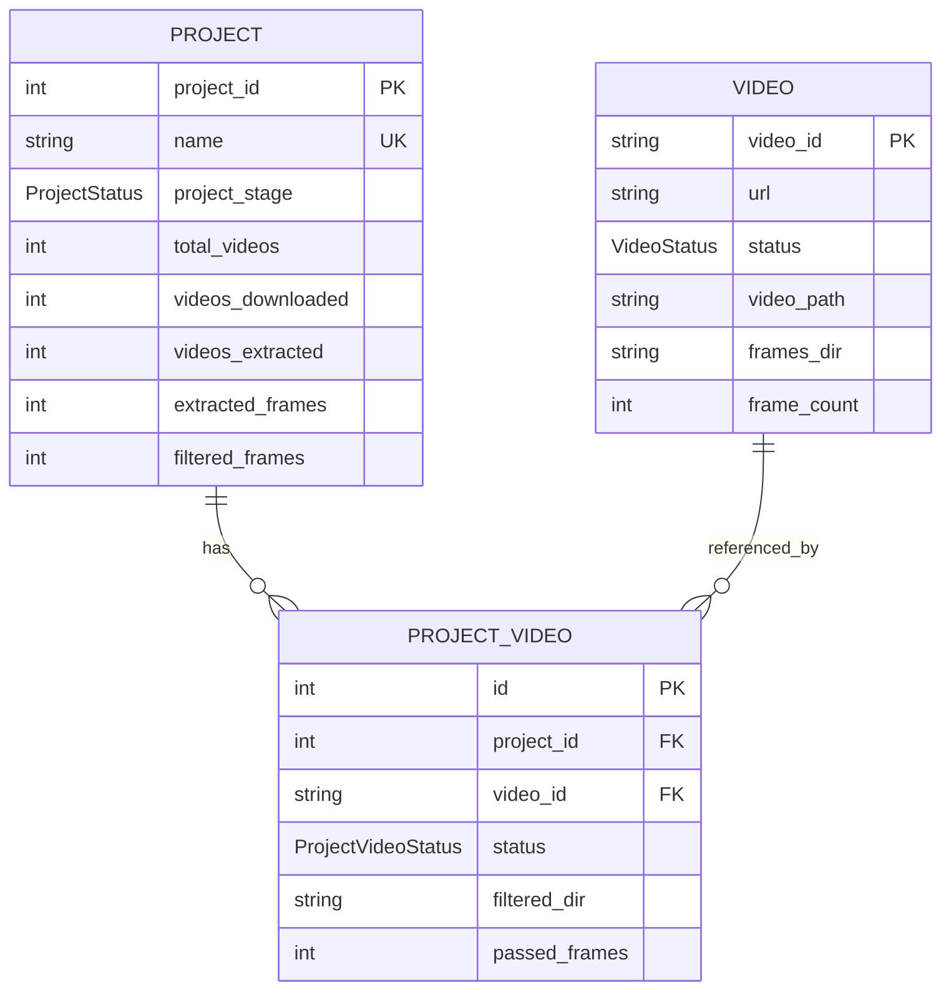

# Database Models

Data Miner uses SQLModel (Pydantic + SQLAlchemy) with PostgreSQL.

---

## Entity Relationship



---

## Tables

### Project

Tracks project-level state and cross-video operations.

| Column | Type | Description |
|--------|------|-------------|
| `project_id` | int | Primary key |
| `name` | str | Unique project name |
| `project_stage` | ProjectStatus | Current stage |
| `total_videos` | int | Total videos in project |
| `videos_pending` | int | Videos pending download |
| `videos_downloaded` | int | Videos downloaded (cumulative, includes extracted) |
| `videos_extracted` | int | Videos with frames extracted |
| `videos_failed` | int | Failed videos |
| `extracted_frames` | int | Total frames extracted |
| `filtered_frames` | int | Total frames passed filter |
| `unique_frames` | int | Frames after dedup |
| `dedup_dir` | str | Dedup output directory |
| `detect_dir` | str | Detection output directory |

> **Note**: Video counts are cumulative where appropriate. `videos_downloaded` includes extracted videos.

---

### Video

Central video table, shared across projects. Tracks download and extraction.

| Column | Type | Description |
|--------|------|-------------|
| `video_id` | str | YouTube video ID (PK) |
| `url` | str | Full YouTube URL |
| `source_type` | SourceType | `SEARCH`, `URL`, `FILE`, `MANUAL` |
| `source_info` | str | Search query or filename |
| `video_path` | str | Downloaded video path |
| `frames_dir` | str | Extracted frames directory |
| `frame_count` | int | Number of extracted frames |
| `status` | VideoStatus | Current status |
| `locked_by` | str | Worker ID holding lock |
| `heartbeat_at` | datetime | Last heartbeat timestamp |

---

### ProjectVideo

Links videos to projects with project-specific processing state.

| Column | Type | Description |
|--------|------|-------------|
| `id` | int | Primary key |
| `project_id` | int | FK to projects |
| `video_id` | str | FK to videos |
| `filtered_dir` | str | Filtered frames directory |
| `passed_frames` | int | Frames that passed filter |
| `status` | ProjectVideoStatus | Current status |
| `locked_by` | str | Worker ID holding lock |
| `heartbeat_at` | datetime | Last heartbeat timestamp |

---

## Status Enums

### VideoStatus (Central Stages)

| Status | Description |
|--------|-------------|
| `PENDING` | Ready for download |
| `DOWNLOADING` | Download in progress |
| `DOWNLOADED` | Download complete |
| `EXTRACTING` | Extraction in progress |
| `EXTRACTED` | Extraction complete |
| `FAILED` | Processing failed |

### ProjectVideoStatus (Per-Project Stages)

| Status | Description |
|--------|-------------|
| `PENDING` | Ready for filtering |
| `FILTERING` | Filter in progress |
| `FILTERED` | Filtered with frames |
| `FILTERED_EMPTY` | Filtered, no frames passed |
| `FAILED` | Processing failed |

### ProjectStatus (Project-Level)

| Status | Description |
|--------|-------------|
| `POPULATING` | Videos being added |
| `FILTERING` | Filter workers active |
| `DEDUP_READY` | Ready for cross-dedup |
| `DEDUPING` | Cross-dedup in progress |
| `DETECT_READY` | Ready for detection |
| `DETECTING` | Detection in progress |
| `COMPLETE` | Pipeline finished |

---

## Concurrency Control

All workers use **row-level locking** with heartbeats:

```python
# Claim pattern with FOR UPDATE SKIP LOCKED
stmt = (
    select(Video)
    .where(Video.status == status)
    .with_for_update(skip_locked=True)
    .limit(1)
)
```

**Heartbeat Recovery**: Workers update `heartbeat_at` every 30 seconds. The monitor worker resets locks older than `stale_threshold_minutes`.

---

## Related Docs

- [Workers](workers.md) - Worker system architecture
- [Architecture Overview](overview.md) - Full system design
