# Data Miner - Architecture & Code Walkthrough

A comprehensive guide to the architecture, design decisions, and code flow of Data Miner, a production-grade video mining pipeline for generating large-scale computer vision datasets from YouTube.

---

## Table of Contents

1. [Executive Summary](#executive-summary)
2. [Architecture Overview](#architecture-overview)
3. [Project Structure](#project-structure)
4. [Database Architecture](#database-architecture)
5. [Worker System](#worker-system)
6. [Processing Modules](#processing-modules)
7. [ML Model Wrappers](#ml-model-wrappers)
8. [Configuration System](#configuration-system)
9. [CLI Interface](#cli-interface)
10. [Data Flow](#data-flow)
11. [Comparison with Earlier Versions](#comparison-with-earlier-versions)
12. [Appendix A: Earlier Versions](#appendix-a-earlier-versions)

---

## Executive Summary

Data Miner is a **PostgreSQL-backed, supervisor-managed video processing pipeline** designed to:

- **Search** YouTube for videos by keywords/hashtags
- **Download** highest quality videos with rate limiting
- **Extract** frames using configurable sampling strategies
- **Filter** frames using SigLIP2 image-text similarity
- **Deduplicate** frames using DINOv3/SigLIP2 embeddings with FAISS
- **Detect** objects using open-set detection models (GroundingDINO, OWLv2)

### Key Design Decisions

| Aspect | Current Design | Rationale |
|--------|---------------|-----------|
| **State Management** | PostgreSQL with SQLModel | ACID guarantees, concurrent access, query flexibility |
| **Worker Model** | Long-running supervisor processes | Automatic restart, centralized logging, process isolation |
| **Concurrency** | Row-level locking with heartbeats | Prevents stale locks, supports worker crashes |
| **Processing Scope** | Central (Video) + Per-Project (ProjectVideo) | Reuse downloads across projects, project-specific filtering |
| **Configuration** | OmegaConf + Pydantic | YAML merging, validation, type safety |

---

## Architecture Overview


### Processing Pipeline


---

## Project Structure

```
data_miner/
├── __init__.py                      # Package init
├── cli.py                           # Click CLI (813 lines)
├── logging.py                       # Loguru + Loki logging
│
├── config/                          # Configuration system
│   ├── __init__.py                  # Exports all config getters
│   ├── config.py                    # Pydantic models (161 lines)
│   ├── constants.py                 # Enums, model IDs, status maps (162 lines)
│   ├── loader.py                    # OmegaConf loader with caching (232 lines)
│   ├── default.yaml                 # Default configuration
│   └── blocked_hashtags.txt         # Hashtag blocklist
│
├── db/                              # Database layer
│   ├── __init__.py
│   ├── connection.py                # SQLModel engine + session
│   ├── models.py                    # Project, Video, ProjectVideo (110 lines)
│   └── operations.py                # CRUD + claim/release functions (962 lines)
│
├── workers/                         # Long-running worker processes
│   ├── __init__.py
│   ├── base.py                      # Base worker classes (368 lines)
│   ├── download.py                  # Download worker (66 lines)
│   ├── extract.py                   # Extraction worker
│   ├── filter.py                    # Filter worker (89 lines)
│   ├── dedup.py                     # Cross-dedup worker (128 lines)
│   ├── detect.py                    # Detection worker (111 lines)
│   ├── monitor.py                   # Project monitor (196 lines)
│   └── backup.py                    # Backup worker
│
├── modules/                         # Core processing logic
│   ├── __init__.py
│   ├── downloader.py                # yt-dlp wrapper
│   ├── frame_extractor.py           # PyAV frame extraction
│   ├── frame_filter.py              # SigLIP-based filtering (243 lines)
│   ├── deduplicator.py              # FAISS-based dedup (470 lines)
│   └── detector.py                  # Object detection
│
├── models/                          # ML model wrappers
│   ├── __init__.py
│   ├── base.py                      # BaseModel abstract class
│   ├── siglip_model.py              # SigLIP2 wrapper
│   ├── dinov3_model.py              # DINOv3 wrapper
│   └── detector_models.py           # Detection model factory
│
└── utils/                           # Utility functions
    ├── __init__.py
    ├── device.py                    # CUDA/CPU device management
    ├── io.py                        # File I/O utilities
    ├── validators.py                # Input validation
    ├── query_generator.py           # YouTube query generation
    ├── db_helper.py                 # Database utilities
    ├── migrate_registry.py          # YAML → DB migration
    └── ssh_helper.py                # SSH for remote backup
```

---

## Database Architecture

The database uses **SQLModel** (Pydantic + SQLAlchemy) with PostgreSQL.

### Entity Relationship Diagram


### Status Enums

#### VideoStatus (Central Stages)
| Status | Description |
|--------|-------------|
| `PENDING` | Ready for download |
| `DOWNLOADING` | Worker is downloading |
| `DOWNLOADED` | Download complete |
| `EXTRACTING` | Worker is extracting frames |
| `EXTRACTED` | Extraction complete |
| `FAILED` | Processing failed |

#### ProjectVideoStatus (Per-Project Filter Stage)
| Status | Description |
|--------|-------------|
| `PENDING` | Ready for filtering |
| `FILTERING` | Worker is filtering |
| `FILTERED` | Filtering complete with frames |
| `FILTERED_EMPTY` | Filtering complete, no frames passed |
| `FAILED` | Processing failed |

#### ProjectStatus (Project-Level Stages)
| Status | Description |
|--------|-------------|
| `POPULATING` | Videos being added/processed |
| `FILTERING` | Filter workers active |
| `DEDUP_READY` | All videos filtered, ready for cross-dedup |
| `DEDUPING` | Cross-dedup in progress |
| `DETECT_READY` | Cross-dedup done, ready for detection |
| `DETECTING` | Detection in progress |
| `COMPLETE` | Pipeline finished |
| `FAILED` | Pipeline failed |

### Key Database Operations

#### Claim/Release Pattern

All workers use atomic `FOR UPDATE SKIP LOCKED` for concurrent safety:

```python
# claim_next_video() in operations.py
stmt = (
    select(Video)
    .where(
        and_(
            Video.status == status,
            or_(
                Video.locked_by.is_(None),
                Video.heartbeat_at < threshold  # Stale lock recovery
            )
        )
    )
    .with_for_update(skip_locked=True)
    .limit(1)
)
```

#### Heartbeat System

Workers update heartbeats every 30 seconds to prove liveness:

```python
def update_video_heartbeat(session: Session, video_id: str, worker_id: str) -> bool:
    """Returns False if lock was lost (another worker completed this)."""
    video = session.get(Video, video_id)
    if video.locked_by != worker_id:
        return False  # Lost lock!
    video.heartbeat_at = datetime.utcnow()
    session.commit()
    return True
```

---

## Worker System

### Worker Hierarchy

```mermaid
classDiagram
    class _BaseWorker {
        <<abstract>>
        +stage_name: StageName
        +poll_interval: float
        +heartbeat_interval: float
        +_init_project()
        +_start_heartbeat(item_id)
        +_stop_heartbeat()
        +_heartbeat_loop()*
        +run()*
    }
    
    class BaseVideoWorker {
        <<abstract>>
        +input_status()*
        +in_progress_status()*
        +output_status()*
        +process(video: Video)*
        +run()
    }
    
    class BaseProjectVideosWorker {
        <<abstract>>
        +input_status()*
        +in_progress_status()*
        +output_status()*
        +process(pv: ProjectVideo, video: Video)*
        +run()
    }
    
    class BaseProjectStageWorker {
        <<abstract>>
        +worker_name: str
        +claim_project(session)*
        +process(project: Project)*
        +complete_project(session, project_id, result)*
        +fail_project(session, project_id, error)*
        +run()
    }
    
    _BaseWorker <|-- BaseVideoWorker
    _BaseWorker <|-- BaseProjectVideosWorker
    _BaseWorker <|-- BaseProjectStageWorker
    
    BaseVideoWorker <|-- DownloadWorker
    BaseVideoWorker <|-- ExtractWorker
    BaseProjectVideosWorker <|-- FilterWorker
    BaseProjectStageWorker <|-- CrossDedupWorker
    BaseProjectStageWorker <|-- ProjectDetectWorker
```



### Worker Types

| Worker | Base Class | Works On | Responsibility |
|--------|-----------|----------|----------------|
| `DownloadWorker` | `BaseVideoWorker` | Video table | Download YouTube videos |
| `ExtractWorker` | `BaseVideoWorker` | Video table | Extract frames from videos |
| `FilterWorker` | `BaseProjectVideosWorker` | ProjectVideo table | Filter frames with SigLIP2 |
| `CrossDedupWorker` | `BaseProjectStageWorker` | Project level | Cross-video deduplication |
| `ProjectDetectWorker` | `BaseProjectStageWorker` | Project level | Object detection |
| `ProjectMonitorWorker` | Custom | N/A | Stage transitions, stale lock recovery |
| `BackupWorker` | Custom | Video table | rsync backup to remote |

### Worker Lifecycle


### Supervisor Integration

Workers are managed by supervisord:

```ini
[program:download]
command=/path/to/.venv/bin/python -m data_miner.workers.download --config %(ENV_CONFIG)s
numprocs=3
process_name=%(program_name)s_%(process_num)02d
autorestart=true
startsecs=5
stopwaitsecs=30
```

Generated via `data-miner workers setup --config path/to/config.yaml`

---

## Processing Modules

### 1. Downloader (`downloader.py`)

Downloads YouTube videos using yt-dlp with configurable rate limiting.

**Key Features:**

- Format selection (max 1080p by default)
- Rate limiting (sleep intervals between downloads)
- Hashtag blocklist filtering
- Timeout handling

```python
class YouTubeDownloader:
    def download_single(self, url: str) -> DownloadResult:
        """Download a single video, returns path and metadata."""
```

### 2. Frame Extractor (`frame_extractor.py`)

Extracts frames from videos using PyAV.

**Sampling Strategies:**
| Strategy | Description |
|----------|-------------|
| `interval` | Every N frames (default: 30) |
| `time` | Every N seconds |
| `keyframe` | Scene change detection |

### 3. Frame Filter (`frame_filter.py`)

Filters frames based on SigLIP2 image-text similarity.

**Two Modes:**

1. **Positive-only**: Frame passes if `max(positive_scores) > threshold`
2. **Positive + Negative**: Also requires `max(positive) - max(negative) > margin`

```python
class FrameFilter:
    def filter_frames(
        self,
        frame_paths: list[Path],
        video_id: str = "unknown",
    ) -> FilterResult:
        """
        Filter frames based on similarity to text prompts.
        Returns FilterResult with passing frames.
        """
```

### 4. Deduplicator (`deduplicator.py`)

Removes duplicate frames using embedding-based similarity with FAISS.

**Two-Phase Algorithm:**

1. **Phase 1 - Per-Video**: Remove temporal duplicates within each video using greedy selection
2. **Phase 2 - Cross-Video**: Use FAISS ANN search to find and remove duplicates across all videos


**Supported Models:**

- **DINOv3** (default): Best quality embeddings
- **SigLIP2**: Memory-efficient, reuses filter model

### 5. Detector (`detector.py`)

Runs open-set object detection on frames.

**Supported Detectors:**
| Detector | Model | Notes |
|----------|-------|-------|
| GroundingDINO | `IDEA-Research/grounding-dino-base` | Text-guided detection |
| OWLv2 | `google/owlv2-base-patch16-ensemble` | Open-vocabulary |

---

## ML Model Wrappers

### Base Model Pattern

All ML models follow a consistent pattern:

```python
class BaseModel(ABC):
    def __init__(self):
        self.model = None
        self.processor = None
        self._loaded = False
    
    @abstractmethod
    def load(self) -> None:
        """Load model to device."""
    
    def unload(self) -> None:
        """Free GPU memory."""
        del self.model, self.processor
        torch.cuda.empty_cache()
    
    def __enter__(self): self.load(); return self
    def __exit__(self, *args): self.unload()
```

### SigLIPModel (`siglip_model.py`)

Wrapper for Google's SigLIP2 for image-text similarity:

```python
class SigLIPModel(BaseModel):
    def compute_similarity(
        self, 
        images: list, 
        texts: list[str], 
        batch_size: int = 16
    ) -> np.ndarray:
        """Returns (N_images, N_texts) similarity matrix."""
```

### DINOv3Model (`dinov3_model.py`)

Wrapper for Meta's DINOv3/DINOv2 for image embeddings:

```python
class DINOv3Model(BaseModel):
    def get_embeddings(
        self, 
        images: list, 
        batch_size: int = 32, 
        normalize: bool = True
    ) -> np.ndarray:
        """Returns (N_images, embedding_dim) array."""
```

---

## Configuration System

### Architecture


### Pydantic Config Models

| Config | Key Fields |
|--------|------------|
| `DownloadConfig` | `output_dir`, `format`, `max_resolution`, `sleep_interval`, `blocked_hashtag_patterns` |
| `ExtractionConfig` | `output_dir`, `strategy`, `interval_frames`, `max_frames_per_video` |
| `FilterConfig` | `output_dir`, `model_id`, `positive_prompts`, `negative_prompts`, `threshold`, `margin_threshold` |
| `DeduplicationConfig` | `output_dir`, `model_type`, `dino_model_id`, `threshold`, `k_neighbors` |
| `DetectionConfig` | `output_dir`, `detector`, `confidence_threshold`, `save_visualizations` |
| `DatabaseConfig` | `url` |
| `SupervisorConfig` | `download_workers`, `extract_workers`, `filter_workers`, `dedup_workers`, `detect_workers` |
| `MonitorConfig` | `poll_interval`, `stale_threshold_minutes`, `cleanup_extracted_videos` |
| `BackupConfig` | `enabled`, `remote_dest`, `delete_after_backup` |

### Config Loading

```python
from data_miner.config import get_filter_config, get_download_config

# Automatically loads from DATA_MINER_CONFIG env var or default.yaml
config = get_filter_config()
print(config.positive_prompts)  # Type-safe access
```

---

## CLI Interface

Built with Click, the CLI provides commands for:

### Core Commands

| Command | Description |
|---------|-------------|
| `init-db` | Initialize database tables |
| `populate` | Add videos from config sources (search, URLs, files) |
| `status` | Show pipeline status |
| `add-video` | Add a single video URL |

### Worker Management

| Command | Description |
|---------|-------------|
| `workers setup` | Generate supervisor config |
| `workers start` | Start all workers |
| `workers stop` | Stop all workers |
| `workers restart` | Restart all workers |
| `workers status` | Show worker status |

### Maintenance

| Command | Description |
|---------|-------------|
| `delete-project` | Delete project and optionally files |
| `delete-videos` | Delete videos with filters |
| `cleanup-orphans` | Remove orphaned videos |
| `force-dedup` | Re-run cross-dedup for project |
| `force-detect` | Re-run detection for project |

---

## Data Flow

### Complete Pipeline Flow


### Output Directory Structure

```
output/
├── videos/                    # Downloaded videos (optional deletion)
│   └── {video_id}.mp4
├── frames_raw/{video_id}/     # All extracted frames
│   └── frame_{N:05d}.jpg
├── frames_filtered/{video_id}/ # Frames passing filter
│   └── frame_{N:05d}.jpg
├── frames_dedup/              # Unique frames (flat)
│   └── {video_id}_frame_{N:05d}.jpg
└── detections/
    ├── annotations.json       # COCO-format annotations
    └── visualizations/        # Bounding box images
```

---

## Comparison with Earlier Versions

### Key Differences: Current vs V3 (Earlier)

| Aspect | Current Version | V3 (Earlier) |
|--------|-----------------|--------------|
| **State Storage** | PostgreSQL database | YAML file (`video_registry.yaml`) |
| **Worker Model** | Supervisor-managed long-running processes | Single CLI command with sequential stages |
| **Concurrency** | Row-level locking with heartbeats | Thread locks in-memory |
| **Multi-Project** | Native support (ProjectVideo table) | Single registry per run |
| **Scalability** | Horizontal (multiple workers) | Vertical (single machine) |
| **Fault Tolerance** | Worker restart, stale lock recovery | Manual restart required |
| **Config** | OmegaConf with caching | OmegaConf without caching |
| **Status Tracking** | Database queries | YAML file reads |

### Architecture Evolution


### Migration Benefits

1. **Reliability**: Automatic worker restart on failure
2. **Scalability**: Multiple workers for each stage
3. **Visibility**: Database queries for status monitoring
4. **Isolation**: Per-project filtering without re-downloading
5. **Recovery**: Stale lock detection and reset

---

## Appendix A: Earlier Versions

### V3 Architecture (File-Based)

The earlier V3 version used a different architecture:

#### Key Components

1. **Video Registry** (`registry.py`): Pydantic-based YAML registry tracking video processing status
2. **Pipeline Orchestrator** (`pipeline.py`): Sequential stage execution with lazy model loading
3. **CLI Commands**: `run-config`, `validate-config`, registry management

#### Registry Structure

```yaml
metadata:
  created: "2024-01-01T00:00:00"
  version: "3.0"
  
videos:
  dQw4w9WgXcQ:
    video_id: dQw4w9WgXcQ
    url: https://youtube.com/watch?v=dQw4w9WgXcQ
    status: filtered
    stages:
      download:
        completed: true
        path: output/videos/dQw4w9WgXcQ.mp4
      extraction:
        completed: true
        frame_count: 450
```

#### Proposed Async Enhancement

The original async pipeline implementation plan proposed an async evolution:

- `asyncio` event loop for orchestration
- `ThreadPoolExecutor` for blocking operations
- `asyncio.Queue` for stage communication
- `BaseStageWorker` abstract class

This design influenced the current worker architecture but was adapted for database-backed state management instead of in-memory queues.

#### Parallel Pipeline Options

Two approaches were considered in the parallel pipeline design:

1. **Per-Video Streaming**: Each video flows through all stages concurrently
2. **Stage-Level Async Queues**: Separate workers per stage with folder-based message passing

The current implementation adopted **Option 2** (stage-level workers) with database-backed coordination instead of async queues.

---

## Summary

Data Miner is a production-grade video mining pipeline featuring:

- **PostgreSQL-backed state management** with SQLModel for type safety
- **Supervisor-managed workers** for reliability and scalability
- **Heartbeat-based locking** for concurrent worker safety
- **Project-level isolation** enabling reuse of downloads across projects
- **Two-phase deduplication** with FAISS for O(N log N) scalability
- **Flexible configuration** with OmegaConf + Pydantic validation
- **Multiple ML backends** for filtering (SigLIP2) and detection (GroundingDINO, OWLv2)
