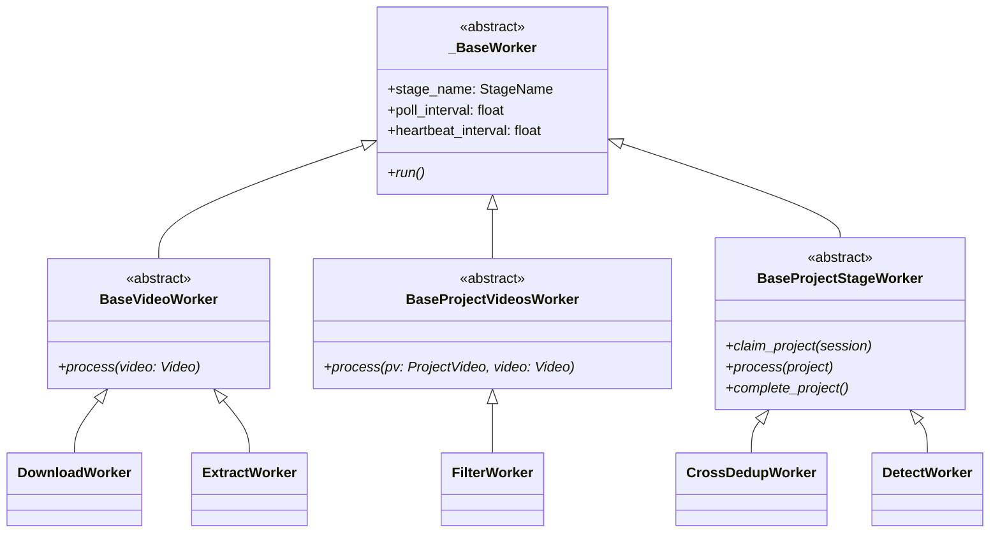
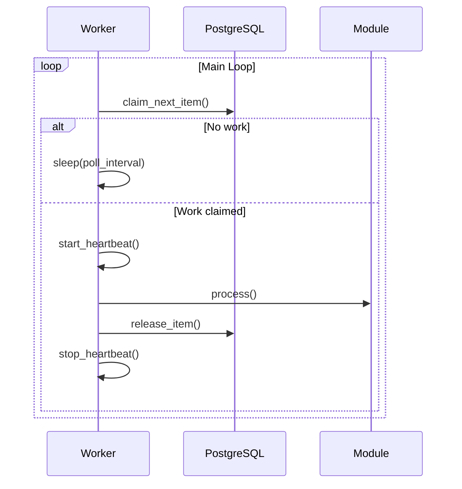

# Worker System

Data Miner uses supervisor-managed long-running worker processes.

---

## Worker Hierarchy



---

## Worker Types

| Worker | Base Class | Table | Responsibility |
|--------|------------|-------|----------------|
| `DownloadWorker` | `BaseVideoWorker` | Video | Download YouTube videos |
| `ExtractWorker` | `BaseVideoWorker` | Video | Extract frames |
| `FilterWorker` | `BaseProjectVideosWorker` | ProjectVideo | Filter with SigLIP2 |
| `CrossDedupWorker` | `BaseProjectStageWorker` | Project | Cross-video dedup |
| `DetectWorker` | `BaseProjectStageWorker` | Project | Object detection |
| `MonitorWorker` | Custom | — | Stage transitions |
| `BackupWorker` | Custom | Video | Remote backup |

---

## Worker Lifecycle



---

## Supervisor Configuration

Workers are managed by supervisord. Generated via:

```bash
data-miner workers setup --config config.yaml
```

Creates `/etc/supervisor/conf.d/data_miner.conf`:

```ini
[program:download]
command=/path/.venv/bin/python -m data_miner.workers.download
numprocs=3
process_name=%(program_name)s_%(process_num)02d
autorestart=true
startsecs=5
stopwaitsecs=30
```

---

## Heartbeat System

Workers update heartbeat timestamps every 30 seconds to prove liveness:

```python
def _heartbeat_loop(self):
    while not self._stop_event.wait(30):
        with get_session() as session:
            still_owner = update_heartbeat(session, item_id, worker_id)
            if not still_owner:
                os._exit(1)  # Supervisor restarts
```

**Stale Lock Recovery**: The monitor worker resets locks older than `stale_threshold_minutes`.

---

## Implementing Custom Workers

### Per-Video Worker

```python
from data_miner.workers.base import BaseVideoWorker
from data_miner.config import StageName

class MyWorker(BaseVideoWorker):
    stage_name = StageName.DOWNLOAD  # Define stage
    
    def process(self, video: Video) -> dict:
        # Do work...
        return {"video_path": "/path/to/video.mp4"}
```

### Project-Level Worker

```python
from data_miner.workers.base import BaseProjectStageWorker

class MyProjectWorker(BaseProjectStageWorker):
    worker_name = "my-stage"
    
    def claim_project(self, session):
        # Claim project with specific status
        pass
    
    def process(self, project):
        # Process entire project
        return {"unique_frames": 500}
    
    def complete_project(self, session, project_id, result):
        # Update project status
        pass
```

---

## Related Docs

- [Database Models](database-models.md) - Table schemas
- [Architecture Overview](overview.md) - Full system design
