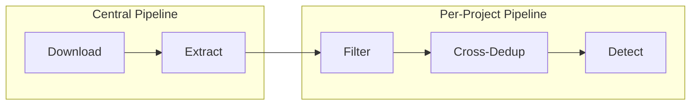

# Data Miner

[](https://www.python.org/downloads/)
[](https://www.postgresql.org/)
[](https://opensource.org/licenses/MIT)

A **PostgreSQL-backed, supervisor-managed video processing pipeline** for generating large-scale computer vision datasets from YouTube videos.

---

## Features

- 🔍 **YouTube Search** - Find videos by keywords and hashtags
- 📥 **Smart Downloads** - Rate-limited downloading with hashtag blocklists
- 🎬 **Frame Extraction** - Configurable sampling strategies (interval, time, keyframe)
- 🎯 **ML Filtering** - SigLIP2-based image-text similarity filtering
- 🔄 **Deduplication** - DINOv3/FAISS-based cross-video deduplication
- 🎯 **Object Detection** - Open-set detection (GroundingDINO, OWLv2)

---

## Quick Links

| User Guide | Developer Docs |
|------------|----------------|
| [Installation](user-guide/installation.md) | [Architecture Overview](architecture/overview.md) |
| [Configuration](user-guide/configuration.md) | [Database Models](architecture/database-models.md) |
| [CLI Reference](user-guide/cli-reference.md) | [Worker System](architecture/workers.md) |
| [Quickstart](user-guide/quickstart.md) | [Contributing](development/contributing.md) |

---

## Architecture Overview



The pipeline uses:
- **PostgreSQL** for state management with row-level locking
- **Supervisor** for worker process management
- **Heartbeat-based locking** for concurrent safety

---

## Getting Started

```bash
# Install
pip install -e .

# Initialize database
data-miner init-db

# Add videos and run pipeline
data-miner populate --config config.yaml
data-miner workers setup --config config.yaml
data-miner workers start
```

See [Quickstart](user-guide/quickstart.md) for the complete workflow.

---

## Project Structure

```
data_miner/
├── cli.py              # CLI commands
├── config/             # Configuration system
├── db/                 # Database layer
├── workers/            # Supervisor-managed workers
├── modules/            # Core processing logic
├── models/             # ML model wrappers
└── utils/              # Utilities
```
