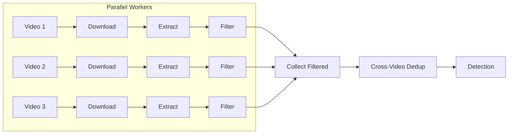
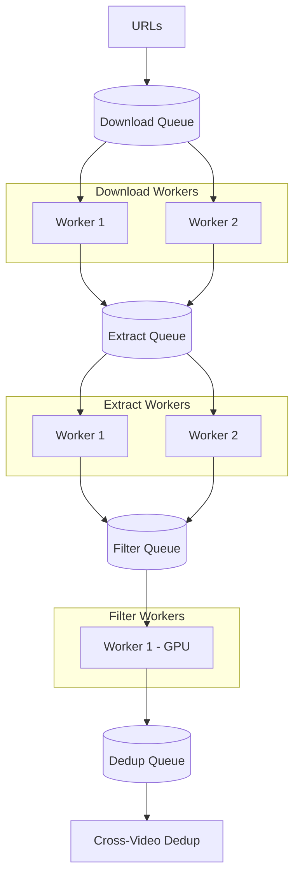

# Parallel Pipeline Design Options

Two architectural approaches for parallelizing download → extract → filter stages.

---

## Option 1: Per-Video Streaming Pipeline

**Concept:** Each video flows through download→extract→filter as a unit, multiple videos processed concurrently.



### Implementation Sketch

```python
from concurrent.futures import ThreadPoolExecutor, as_completed
from dataclasses import dataclass
from pathlib import Path

@dataclass
class VideoProcessResult:
    video_id: str
    filtered_dir: Path
    frame_count: int

class StreamingPipeline:
    def __init__(self, config, registry):
        self.config = config
        self.registry = registry
        self.downloader = YouTubeDownloader(config.download)
        self.extractor = FrameExtractor(config.extraction)
        # Shared filter model (thread-safe for inference)
        self.filter = FrameFilter(config.filter)
    
    def process_single_video(self, url: str) -> VideoProcessResult:
        """Process one video through download → extract → filter."""
        video_id = get_video_id(url)
        
        # Stage 1: Download
        download_result = self.downloader.download_single(url)
        if not download_result.success:
            return None
        
        # Stage 2: Extract frames
        extraction_result = self.extractor.extract_video(
            download_result.output_path, video_id
        )
        
        # Stage 3: Filter frames
        filter_result = self.filter.filter_frames(
            frame_paths=extraction_result.output_paths,
            classes=self.config.classes,
            video_id=video_id,
        )
        
        # Optional: Delete raw frames to save disk
        if self.config.cleanup_raw_frames:
            shutil.rmtree(extraction_result.output_dir)
        
        return VideoProcessResult(
            video_id=video_id,
            filtered_dir=self.config.filter.output_dir / video_id,
            frame_count=filter_result.passed_frames,
        )
    
    def run(self, urls: list[str], max_workers: int = 3):
        """Run parallel video processing."""
        results = []
        
        with ThreadPoolExecutor(max_workers=max_workers) as executor:
            futures = {
                executor.submit(self.process_single_video, url): url
                for url in urls
            }
            
            for future in as_completed(futures):
                result = future.result()
                if result:
                    results.append(result)
                    # Update registry per-video
                    self.registry.update_video(result.video_id, status="filtered")
        
        # Cross-video deduplication (after all videos filtered)
        all_filtered_frames = self._collect_filtered_frames(results)
        dedup_result = self.deduplicator.deduplicate_cross_video(all_filtered_frames)
        
        return dedup_result
```

### Pros/Cons

| Pros | Cons |
|------|------|
| Simple mental model | Limited by slowest stage |
| Easy error handling per-video | Filter model loaded N times if not shared |
| Good for small batches | Thread contention on GPU |

---

## Option 2: Stage-Level Async Queues (Folder-Based)

**Concept:** Separate workers for each stage, communicate via folder paths in queues. Each stage runs independently.



### Implementation Sketch

```python
import asyncio
from asyncio import Queue
from dataclasses import dataclass
from pathlib import Path

@dataclass
class StageMessage:
    video_id: str
    folder_path: Path  # Pass folder, not frames
    stage: str

class AsyncQueuePipeline:
    def __init__(self, config):
        self.config = config
        # Async queues between stages
        self.download_queue = Queue()   # Input: URLs
        self.extract_queue = Queue()    # Input: video paths
        self.filter_queue = Queue()     # Input: frame folders
        self.dedup_queue = Queue()      # Input: filtered folders
        
        self.shutdown = asyncio.Event()
    
    # =========== DOWNLOAD WORKER ===========
    async def download_worker(self, worker_id: int):
        """Download videos, output video file path to extract queue."""
        downloader = YouTubeDownloader(self.config.download)
        
        while not self.shutdown.is_set():
            try:
                url = await asyncio.wait_for(
                    self.download_queue.get(), timeout=1.0
                )
            except asyncio.TimeoutError:
                continue
            
            # Run blocking download in thread pool
            loop = asyncio.get_event_loop()
            result = await loop.run_in_executor(
                None, downloader.download_single, url
            )
            
            if result.success:
                # Pass VIDEO FOLDER to next stage
                await self.extract_queue.put(StageMessage(
                    video_id=result.video_id,
                    folder_path=result.output_path,
                    stage="downloaded",
                ))
            
            self.download_queue.task_done()
    
    # =========== EXTRACT WORKER ===========
    async def extract_worker(self, worker_id: int):
        """Extract frames, output frames folder to filter queue."""
        extractor = FrameExtractor(self.config.extraction)
        
        while not self.shutdown.is_set():
            try:
                msg = await asyncio.wait_for(
                    self.extract_queue.get(), timeout=1.0
                )
            except asyncio.TimeoutError:
                continue
            
            loop = asyncio.get_event_loop()
            result = await loop.run_in_executor(
                None,
                extractor.extract_video,
                msg.folder_path,
                msg.video_id,
            )
            
            # Pass FRAMES FOLDER to next stage
            await self.filter_queue.put(StageMessage(
                video_id=msg.video_id,
                folder_path=result.output_dir,  # Folder of frames
                stage="extracted",
            ))
            
            self.extract_queue.task_done()
    
    # =========== FILTER WORKER (GPU) ===========
    async def filter_worker(self):
        """Filter frames using GPU. Single worker to avoid GPU contention."""
        filter_model = FrameFilter(self.config.filter)
        
        while not self.shutdown.is_set():
            try:
                msg = await asyncio.wait_for(
                    self.filter_queue.get(), timeout=1.0
                )
            except asyncio.TimeoutError:
                continue
            
            # Get all frame paths from folder
            frame_paths = sorted(msg.folder_path.glob("*.jpg"))
            
            loop = asyncio.get_event_loop()
            result = await loop.run_in_executor(
                None,
                filter_model.filter_frames,
                frame_paths,
                self.config.classes,
                msg.video_id,
            )
            
            # Pass FILTERED FOLDER to dedup
            await self.dedup_queue.put(StageMessage(
                video_id=msg.video_id,
                folder_path=self.config.filter.output_dir / msg.video_id,
                stage="filtered",
            ))
            
            # Optional: cleanup raw frames
            if self.config.cleanup_raw_frames:
                shutil.rmtree(msg.folder_path)
            
            self.filter_queue.task_done()
    
    # =========== MAIN RUNNER ===========
    async def run(self, urls: list[str]):
        """Run the full async pipeline."""
        # Seed the download queue
        for url in urls:
            await self.download_queue.put(url)
        
        # Start workers
        workers = [
            asyncio.create_task(self.download_worker(1)),
            asyncio.create_task(self.download_worker(2)),
            asyncio.create_task(self.extract_worker(1)),
            asyncio.create_task(self.extract_worker(2)),
            asyncio.create_task(self.filter_worker()),  # Single GPU worker
        ]
        
        # Wait for all queues to drain
        await self.download_queue.join()
        await self.extract_queue.join()
        await self.filter_queue.join()
        
        # Signal shutdown
        self.shutdown.set()
        await asyncio.gather(*workers, return_exceptions=True)
        
        # Collect all filtered folders for dedup
        filtered_folders = {}
        while not self.dedup_queue.empty():
            msg = self.dedup_queue.get_nowait()
            filtered_folders[msg.video_id] = list(msg.folder_path.glob("*.jpg"))
        
        # Final cross-video dedup
        deduplicator = Deduplicator(self.config.deduplication)
        return deduplicator.deduplicate_cross_video(filtered_folders)
```

### Pros/Cons

| Pros | Cons |
|------|------|
| Maximum parallelism | More complex error handling |
| Each stage scales independently | Debugging harder |
| Natural backpressure via queues | Need careful queue sizing |
| GPU worker isolation | asyncio learning curve |

---

## Comparison Summary

| Aspect | Option 1 (Per-Video) | Option 2 (Async Queues) |
|--------|---------------------|-------------------------|
| **Complexity** | Low | High |
| **Parallelism** | Per-video | Per-stage |
| **GPU Utilization** | Moderate | High (dedicated worker) |
| **Memory** | Higher (multiple videos in flight) | Controlled via queue size |
| **Error Recovery** | Easy (per-video retry) | Complex (stage isolation) |
| **Best For** | < 50 videos | 100+ videos |

---

## Recommendation

- **Start with Option 1** for simplicity
- **Migrate to Option 2** if you need to process 100+ videos or want better GPU utilization
- Key insight: Pass **folder paths** between stages, not frame data, to minimize memory usage
