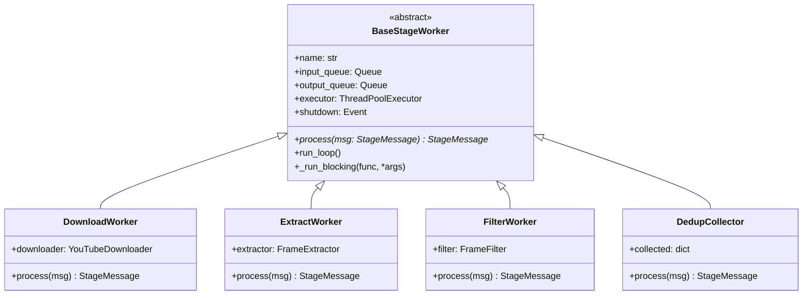
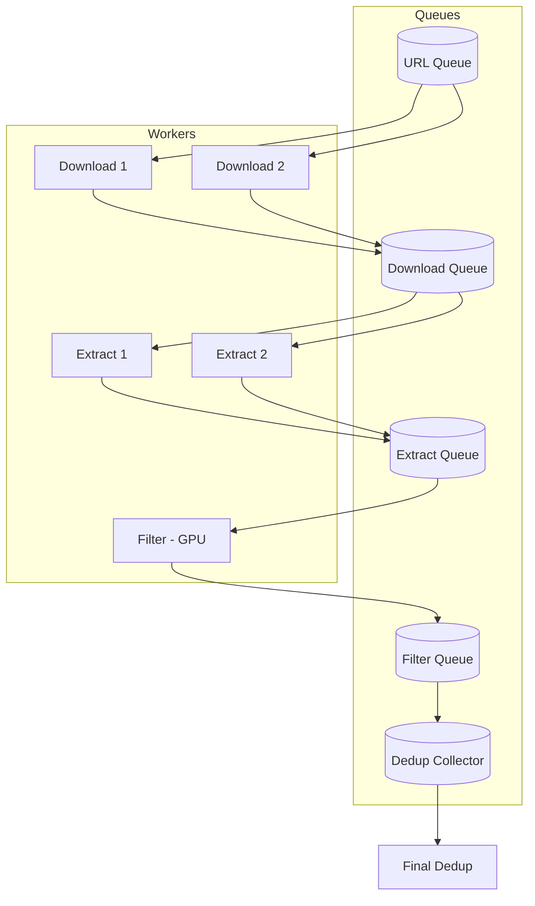

# Async Pipeline Implementation Design

> **Goal**: Process 1000s of videos efficiently with stage-level parallelism

---

## 1. Concurrency Model Analysis

### Comparison Matrix

| Aspect | `asyncio` | `threading` | `multiprocessing` |
|--------|-----------|-------------|-------------------|
| **GIL Impact** | N/A (single thread) | Blocked for CPU | No GIL (separate process) |
| **I/O Bound** | ✅ Excellent | ✅ Good | ⚠️ Overkill |
| **CPU Bound** | ❌ Poor | ❌ Poor (GIL) | ✅ Excellent |
| **GPU Sharing** | ✅ Easy (same process) | ✅ Works | ❌ Complex (IPC) |
| **Memory** | Low | Moderate | High (per-process) |
| **Queue Overhead** | Minimal | Minimal | Serialization cost |

### Workload Analysis

| Stage | I/O vs CPU | Best Fit |
|-------|------------|----------|
| **Download** | Network I/O | `asyncio` + `aiohttp` or ThreadPool |
| **Extract** | Disk I/O + CPU decode | ThreadPool (PyAV releases GIL) |
| **Filter** | GPU compute | ThreadPool (PyTorch releases GIL) |
| **Dedup** | GPU compute | ThreadPool |
| **Detect** | GPU compute | ThreadPool |

### Recommendation

```
┌─────────────────────────────────────────────────────────────┐
│  asyncio Event Loop (Main Orchestrator)                     │
│  ├── manages queues and flow control                        │
│  └── spawns ThreadPoolExecutor for blocking operations      │
└─────────────────────────────────────────────────────────────┘
```

**Hybrid approach**: `asyncio` for orchestration + `ThreadPoolExecutor` for blocking calls.

- PyTorch and PyAV **release the GIL** during heavy computation
- Keeps GPU in single process (avoids CUDA context issues)
- Simple queue semantics with `asyncio.Queue`

---

## 2. Queue Communication Analysis

### Options

| Queue Type | Pros | Cons | Best For |
|------------|------|------|----------|
| `asyncio.Queue` | Simple, in-memory | Single process only | Our use case |
| `queue.Queue` | Thread-safe | Blocks event loop | Mixed threading |
| `multiprocessing.Queue` | Cross-process | Serialization overhead | Not needed |
| Redis/RabbitMQ | Distributed, persistent | External dependency | Multi-machine |

### Message Protocol

**Principle**: Pass **folder paths** (lightweight), not data (heavy).

```python
@dataclass
class StageMessage:
    video_id: str
    input_path: Path      # Folder/file from previous stage
    metadata: dict        # Optional stage-specific data
    timestamp: float      # For monitoring latency
```

### Queue Sizing

```
max_queue_size = 2 × num_workers_next_stage
```

This provides backpressure without blocking upstream workers.

---

## 3. Architecture Design

### Class Hierarchy (Reusable Components)



### Base Worker Pattern

```python
class BaseStageWorker(ABC):
    """Abstract base for all pipeline stage workers."""
    
    def __init__(
        self,
        name: str,
        input_queue: asyncio.Queue,
        output_queue: asyncio.Queue,
        executor: ThreadPoolExecutor,
    ):
        self.name = name
        self.input_queue = input_queue
        self.output_queue = output_queue
        self.executor = executor
        self.shutdown = asyncio.Event()
        self.processed_count = 0
    
    @abstractmethod
    def process(self, msg: StageMessage) -> Optional[StageMessage]:
        """Process one message. Return None to drop."""
        pass
    
    async def run_loop(self):
        """Main worker loop - DO NOT OVERRIDE."""
        while not self.shutdown.is_set():
            try:
                msg = await asyncio.wait_for(
                    self.input_queue.get(), timeout=1.0
                )
            except asyncio.TimeoutError:
                continue
            
            try:
                # Run blocking process() in thread pool
                result = await self._run_blocking(self.process, msg)
                if result:
                    await self.output_queue.put(result)
                self.processed_count += 1
            except Exception as e:
                logger.error(f"{self.name} failed on {msg.video_id}: {e}")
            finally:
                self.input_queue.task_done()
    
    async def _run_blocking(self, func, *args):
        """Execute blocking function in thread pool."""
        loop = asyncio.get_event_loop()
        return await loop.run_in_executor(self.executor, func, *args)
```

### Pipeline Orchestrator



```python
class AsyncPipelineOrchestrator:
    """Manages all stages and workers."""
    
    def __init__(self, config: PipelineConfig):
        self.config = config
        
        # Shared thread pool for blocking ops
        self.executor = ThreadPoolExecutor(max_workers=8)
        
        # Queues (sized for backpressure)
        self.url_queue = asyncio.Queue()
        self.download_queue = asyncio.Queue(maxsize=4)
        self.extract_queue = asyncio.Queue(maxsize=4)
        self.filter_queue = asyncio.Queue(maxsize=2)
        self.dedup_queue = asyncio.Queue()
        
        # Workers
        self.workers = []
    
    def _create_workers(self):
        # Download workers (I/O bound, 2-3 concurrent)
        for i in range(2):
            self.workers.append(DownloadWorker(
                name=f"download-{i}",
                input_queue=self.url_queue,
                output_queue=self.download_queue,
                executor=self.executor,
                config=self.config.download,
            ))
        
        # Extract workers (CPU bound, 2 concurrent)
        for i in range(2):
            self.workers.append(ExtractWorker(
                name=f"extract-{i}",
                input_queue=self.download_queue,
                output_queue=self.extract_queue,
                executor=self.executor,
                config=self.config.extraction,
            ))
        
        # Filter worker (GPU, single to avoid contention)
        self.workers.append(FilterWorker(
            name="filter-gpu",
            input_queue=self.extract_queue,
            output_queue=self.filter_queue,
            executor=self.executor,
            config=self.config.filter,
        ))
        
        # Dedup collector (accumulates results)
        self.dedup_collector = DedupCollector(
            input_queue=self.filter_queue,
            output_queue=self.dedup_queue,
        )
        self.workers.append(self.dedup_collector)
    
    async def run(self, urls: list[str]):
        # Seed URL queue
        for url in urls:
            await self.url_queue.put(StageMessage(
                video_id=get_video_id(url),
                input_path=url,
                metadata={},
                timestamp=time.time(),
            ))
        
        # Start all workers
        self._create_workers()
        tasks = [asyncio.create_task(w.run_loop()) for w in self.workers]
        
        # Wait for pipeline to drain
        await self.url_queue.join()
        await self.download_queue.join()
        await self.extract_queue.join()
        await self.filter_queue.join()
        
        # Shutdown workers
        for w in self.workers:
            w.shutdown.set()
        await asyncio.gather(*tasks, return_exceptions=True)
        
        # Final cross-video dedup
        return await self._run_final_dedup()
```

---

## 4. Worker Implementations (Reusing Base)

Each worker only implements `process()`:

```python
class DownloadWorker(BaseStageWorker):
    def __init__(self, config, **kwargs):
        super().__init__(**kwargs)
        self.downloader = YouTubeDownloader(config)
    
    def process(self, msg: StageMessage) -> Optional[StageMessage]:
        result = self.downloader.download_single(msg.input_path)
        if not result.success:
            return None
        return StageMessage(
            video_id=msg.video_id,
            input_path=result.output_path,
            metadata={"title": result.title, "duration": result.duration},
            timestamp=time.time(),
        )

class ExtractWorker(BaseStageWorker):
    def __init__(self, config, **kwargs):
        super().__init__(**kwargs)
        self.extractor = FrameExtractor(config)
    
    def process(self, msg: StageMessage) -> Optional[StageMessage]:
        result = self.extractor.extract_video(msg.input_path, msg.video_id)
        return StageMessage(
            video_id=msg.video_id,
            input_path=result.output_dir,  # Folder of frames
            metadata={"frame_count": result.frame_count},
            timestamp=time.time(),
        )

class FilterWorker(BaseStageWorker):
    def __init__(self, config, classes, **kwargs):
        super().__init__(**kwargs)
        self.filter = FrameFilter(config)
        self.classes = classes
    
    def process(self, msg: StageMessage) -> Optional[StageMessage]:
        frames = sorted(Path(msg.input_path).glob("*.jpg"))
        result = self.filter.filter_frames(frames, self.classes, msg.video_id)
        
        if result.passed_frames == 0:
            return None
        
        return StageMessage(
            video_id=msg.video_id,
            input_path=self.filter.config.output_dir / msg.video_id,
            metadata={"passed": result.passed_frames, "total": result.total_frames},
            timestamp=time.time(),
        )
```

---

## 5. Scaling Considerations

### Worker Count Guidelines

| Stage | Workers | Rationale |
|-------|---------|-----------|
| Download | 2-3 | Network limited, yt-dlp is heavy |
| Extract | 2 | CPU decode, disk I/O |
| Filter | 1 | GPU bound, avoid VRAM contention |
| Dedup Collector | 1 | Just accumulates |

### Memory Management

```python
# Cleanup raw frames after filtering
if config.cleanup_intermediate:
    shutil.rmtree(msg.input_path)  # Delete frames_raw/video_id
```

### Monitoring

```python
@dataclass
class PipelineMetrics:
    stage_counts: dict[str, int]      # processed per stage
    stage_latencies: dict[str, float] # avg time per stage
    queue_depths: dict[str, int]      # current queue sizes
    errors: list[tuple[str, str]]     # (video_id, error)
```

---

## 6. File Structure

```
video_miner_async/
├── async_pipeline/
│   ├── __init__.py
│   ├── base_worker.py      # BaseStageWorker
│   ├── messages.py         # StageMessage dataclass
│   ├── workers/
│   │   ├── download.py     # DownloadWorker
│   │   ├── extract.py      # ExtractWorker
│   │   ├── filter.py       # FilterWorker
│   │   └── dedup.py        # DedupCollector
│   ├── orchestrator.py     # AsyncPipelineOrchestrator
│   └── metrics.py          # PipelineMetrics
```

---

## 7. Migration Path

1. **Phase 1**: Create `async_pipeline/` module alongside existing `pipeline.py`
2. **Phase 2**: Add CLI flag `--async-mode` to select new pipeline
3. **Phase 3**: Validate with 100 videos, compare results
4. **Phase 4**: Deprecate old sequential pipeline

---

## Summary

| Decision | Choice | Reasoning |
|----------|--------|-----------|
| **Concurrency** | asyncio + ThreadPool | GPU in single process, GIL released by PyTorch |
| **Queue Type** | `asyncio.Queue` | Simple, backpressure built-in |
| **Message Format** | Folder paths | Lightweight, no serialization |
| **GPU Workers** | Single | Avoid VRAM contention |
| **Base Class** | `BaseStageWorker` | DRY principle, common `run_loop()` |
